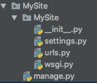

!!! tip "p个大s"
    这里用的是python3.7和Django2.0.假设全都安装成功= =
    
    然后这个是我做个人网站的一个过程=。=
    
    然后这个也不能算是个教程吧=。=
    
    然后这只是粗糙的记录=。=
    
    最后，防脱发用霸王=3=

###生成一个完整的django项目
 **创建Django项目**

```
django-admin.py startproject MySite
```
 
 此时，你会看到这样的文件夹：


 

 **运行一下你的项目，看看有没有成功**：
```
./manage.py runserver
```
    终端会显示这些：
    ![image_1cjvd8tjj4aq48ihk21n4d1b38m.png-79kB][2]
    有红字也不要担心，因为还没有设置呢！
    接下来去`http://127.0.0.1:8000/`看一看：
    ![image_1cjvdb63b1bcl1jnpupct2610j423.png-121.7kB][3]
    成功了！
    <font color='red'>**ps：**</font>如果想要外部机器（同一网络）访问本机的Django服务的话，要写成`./manage.py runserver 0.0.0.0:9999`,并将`setting.py`中的`ALLOWED_HOSTS`改为`ALLOWED_HOSTS = ['*', ]`，一定要加**逗号**！
 - **改一些配置**
    **ps**：这里的顺序可能不对。= =
    1. 更改`/MySite/MySite/settings.py`中的内容
      Django默认的`DATABASES`是`sqlite`，是这样的：
      ![image_1cjvdpm002a81skaf2714pr1f2t2g.png-13.3kB][4]
      这里我是用的是`MySQL`数据库，因此，我要改成这样：

        ```python
        DATABASES = {
            'default': {
                'ENGINE': 'django.db.backends.mysql',
                'NAME': 'MySite',
                'USER': 'xxx',
                'PASSWORD': 'xxxxx',
                'HOST': '127.0.0.1',
                'PORT': '3306'
            }
        }
        ```
      <font color='red'>这里一定要确保数据库已经存在了。</font>在这之前，需要创建数据库，像这样滴：
    ```
    create database MySite CHARACTER SET utf8 COLLATE utf8_general_ci;
    ```
    
     还要更改**时区**和**语言**
        ![image_1cjveevfspif39o6hm2mnucn3d.png-5.8kB][5]
        
2. 向`/MySite/MySite/__init__.py`中添加内容
     ```python
     import pymysql
     pymysql.install_as_MySQLdb()
     ```


 - **数据库迁移**
    首先，执行
    ```
    ./manage.py makemigrations
    ```
    然后，执行
    ```
    ./manage.py migrate
    ```
    这样就成功啦～
    ![image_1cjvfbgkulc0gvt1gl9cu01sgd4a.png-70.9kB][6]
    
 - **创建超级用户**
    创建超级用户是用来登陆到admin后台管理中的
    执行
    ```
    ./manage.py createsuperuser
    ```
    然后按照提示填写就好啦～
    **ps：**一定要先进行数据库迁移，再创建用户。否则，会出现![image_1cjvfv00s1kuo119k1t8dh581ug84n.png-6.3kB][7]
    
 - **进入admin看看**
 在浏览器中输入`http://127.0.0.1:8000/admin`，会出现登录页面，此时会发现全都变成中文了，说明之前的设置生效了。
![image_1cjvg4n791bobtht1smbf1f1u7t54.png-41.6kB][8]
接下来，就可以用刚刚创建的用户登陆了，查看后台数据了！

###项目正式开始

 - **创建app**
    执行`./manage.py startapp Post`,查看项目结构，如下：
    ![image_1cjvibkvpei29mk1doucvv12j15h.png-10kB][9]
    
    完成上步操作后，需要在`/MySite/MySite/settings.py`中将app添加进去：
    ![image_1cjvifci91ss01v9l1l1g1m5moo25u.png-14.5kB][10]
    接下来，需要在app文件夹下添加`urls.py`，用于路由映射：
    ![image_1cjvilv4o14lf9a9371jkjhcr7o.png-9.4kB][11]
    在`urls.py`中这样写：
    ```python
    app_name = 'Post'   # 这里是为了url反向解析用

    urlpatterns = [
        # 这里放映射的view
    ]
    ```
    同时，在`/MySite/MySite/urls.py`中需要添加对`Post.urls`的映射：
    ```python
    from django.contrib import admin
    from django.urls import path, include
    
    urlpatterns = [
        path('admin/', admin.site.urls),
        path(r'', include('Post.urls')),
    ]
    ```

 - **创建模型**
    在app下的`models.py`创建自己的模型就可以啦~
    ```python
    from django.db import models

    class Category(models.Model):
        """分类"""
        name = models.CharField(max_length=100)
    
    
    class Tag(models.Model):
        """标签"""
        name = models.CharField(max_length=100)
    
    
    class Post(models.Model):
        """文章"""
        title = models.CharField(max_length=100)
        body = models.TextField()
        created_time = models.DateTimeField()
        modified_time = models.DateTimeField()
        excerpt = models.CharField(max_length=200, blank=True)  # 文章摘要，可为空
        category = models.ForeignKey(Category, on_delete=True)  # ForeignKey表示1对多（多个post对应1个category）
        tags = models.ManyToManyField(Tag, blank=True)
        views = models.PositiveIntegerField(default=0)  # 阅读量
    ```
    
    <font color='red'>然后一定不要忘记再进行**数据库迁移**啊！！</font>
    
 - **前端模版**
    这里的前端模板使用的是模板之家的
    链接?：http://www.cssmoban.com/tags.asp?n=html5
    
    首先创建templates目录，结构如下：
    ![image_1cjvlp6q840k17eg1cubd8i1qpi8i.png-12.8kB][12]
    此时，需要在`setting.py`中添加关于模板的配置：
    ![image_1cjvls24ohf91gngccsuk5ce8v.png-39.8kB][13]
    
    接下来是static目录，结构如下：
    ![image_1cjvlvc96ir9hk4ubn1jk73uq9c.png-9.5kB][14]
    显而易见，这里放的是一些css、js文件等

 - **index视图**
    首先，在`Post/views.py`中实现`index`方法：
    ```python
    def index(request):
        """
        主页
        :param request:
        :return:
        """
        return render(request=request, template_name='Post/index.html')
    ```
    `request`为请求对象;
    `template_name`为渲染的前端页面的路径字符串（相对templates目录）
    
  然后，在`Post/urls.py`中进行路由映射：
  ```python
  urlpatterns = [
        url(r'^$', views.index, name="index"),
]
  ```
  
  <font color='red'>注意：如果你主页的url是空，正则必须写成**^$**</font>
  
  最后，一定要要修改静态页面中引用的路径。
  对于Django来说，可以使用`static`标签。
  在页面开头引入``，这个对应的配置信息是![image_1ck6k15rg1j1lfei3j1aoepvha9.png-2.7kB][15]
  并将页面中的路径改为![image_1ck6k35as1gm97pr1gng1ch41ns7am.png-4.5kB][16]
  <font color='red'>**ps：**</font>对于css或者js中的引用也不要忘了改！
  
  运行一下。
  ![image_1ck6k74sv5p3212h1osclqub3.png-422.3kB][17]
  搞定！
  

 - **向前端渲染及分页**
 首先，更改`index()`
 ```python
    from django.shortcuts import render
    from django.core.paginator import Paginator
    from .models import Post
    
    
    def index(request):
        """
        主页
        :param request:
        :return:
        """
    
        post = Post.objects.all()
    
        limit = 3
        paginator = Paginator(post, limit)
        page = request.GET.get('page', 1)
    
        result = paginator.page(page)
        context = {
            "post_list": result,
            "page": page
        }
        return render(request=request, template_name='Post/index.html', context=context)
 ```
 然后修改`index.html`
 ![image_1ck6ueleqhgg1ml215qg8461hpkbg.png-122kB][18]
 
 运行看一下
 ![image_1ck6uhi34mt1nqi1a3i46p204bt.png-173.5kB][19]
 搞定！
 
 - **更改index.html中的所有跳转链接**
 在这里，我用的是url的反向解析。这样可以减轻后期维护成本。因此，就需要在urls.py中添加如下信息：
    ![image_1ck6vajq31hn72jkr4hjpe1dt1ca.png-11.1kB][20]

    ![image_1ck6vb9cieha182n1eg12rt7qfcn.png-7.8kB][21]
    在html中修改成如下：
    ![image_1ck6vcgaqlpe8dqsf8qnn17rndk.png-3.5kB][22]

 - **博客文章页面**
    别忘了改跳转链接！！！！
    文章详情页和主页大体结构是相似的，因此，这里使用了模版继承。
    在基类模版里，使用这个，将子类模版需要填充的位置占位
    ![image_1ck99cgjpsqtjq41hnk148j1ak9.png-4.6kB][23]
    然后在子类模板中，使用相同的标签将填充的内容进行包裹
    最后，不要忘了在子类模板中再写上``和``
    
    在`Post/urls.py`中添加详情页的url：
    ```
    url(r'^detail/post-(?P<pk>\d+)$', views.detail, name="detail"),
    ```
    并添加detail视图
    ```python
    def detail(request, pk):
    """
    :param request: 
    :param pk: 接收到的文章的主键id
    :return: 
    """
    return render(request, template_name='Post/blog.html', )
    ```
    
    运行看一下吧！
    ![image_1ck99kovo16t218tb11lo19k441mm.png-257kB][24]
    搞定！
    继续在视图中添加内容，将假数据改为真实的文章数据
    对于多对多的关系来说，可以写成这样：
    ![image_1ck9hp2bkhnqamtcnbbm415813.png-10.1kB][25]
    看一看效果吧！
    ![image_1ck9i8vcll104c16qd1i9r2k01g.png-264.3kB][26]
    
    
    <font color='red'>**接下来就是让我可以上传markdown格式的文本了！
    这个暂时先不解决了= =，小本本记下来**</font>
    
 - **添加分类栏**
    这里使用自定义模版标签！
    首先，在app文件夹下，创建`templatetags`文件夹，然后创建一个py文件，里面定义模版标签，目录是这样滴：
    ![image_1ckc3ee0n117f10is15k8idd402d.png-9.9kB][27]
    
    然后定义一个分类目录的标签：
    ```python
    from django import template
    from ..models import Category
   
    register = template.Library()

    @register.simple_tag
    def get_categories():
        """
        分类目录标签
        :return:
        """
        return Category.objects.all()
    ```
    在前端引用自定义标签时，一定要开头加载自定义的模版标签所在的py文件，``,然后再使用：
    ```html
    
    
        <li><a href="#">{{ category.name }}</a></li>
    
    ```
    
    看一下效果吧！
    ![企业微信截图_f1e71885-52fc-43e6-b722-a51dc80c8934.png-364.8kB][28]
    搞定！
    
 - **评论功能**
    评论功能新建一个app
    ```
    ./manage.py startapp comment 
    ```
    不要忘了把它注册到django中
    ![image_1ckc6rca21j8d73ogvq16a01cl01e.png-15.2kB][29]
    
    创建模型：
    ```python
    from django.db import models

    class Comment(models.Model):
        name = models.CharField(max_length=20)
        email = models.EmailField(max_length=50)
        website = models.URLField(blank=True)
        text = models.TextField()
        created_time = models.DateTimeField(auto_now_add=True)
    
        post = models.ForeignKey('Post.Post', on_delete=True)  # 一篇文章有多个评论
    ```
    
    不要忘了注册到admin中啊！
    ```
    admin.site.register(Comment)
    ```
    最重要的一步。数据库迁移啊！！！
    
    这里要实现的是点击submit按钮，会提交评论
    在`comment/views.py`中添加视图：
    ```python
    from django.shortcuts import render, redirect
    from .models import Comment
    from Post.models import Post
    from django.urls import reverse
    
    
    def submit_comment(request, pk):
        """
        处理提交的评论
        :param request:
        :return:
        """
        post = request.POST
        comment = Comment()
        comment.name = post.get("name")
        comment.email = post.get('email')
        comment.website = post.get('website')
        comment.text = post.get('message')
        comment.post = Post.objects.get(id=pk)
        comment.save()
    
        return redirect(reverse('Post:detail', kwargs={"pk": pk}))
    ```
    
    更改前端页面中的评论部分：
    ![image_1ckcba269rui1u8a8rt1chqulf2r.png-37.9kB][30]
    
    在`comment/urls.py`中添加映射：
    ![image_1ckcc3v5apog1quqljj7lrrh21p.png-13.1kB][31]
    试一下吧！
    ![image_1ckcc59nn17vv1dqq1lot1lak8tk26.png-24.9kB][32]
    搞定！
    
    <font color='red'>**后面再完善一下。搞成可以回复的啵！小本本记下来～**</font>
    
 - **最新评论**
    这个也写成自定义标签啵。
    ```python
    @register.simple_tag
    def get_latest_comment():
        """
        获取最新评论
        :return:
        """
        comment_list = Comment.objects.all()[:5].only('post', 'text')   # 只获取特定字段
        return comment_list
    ```
    ![image_1ckceclnl10r41ocn18rlu2mpfc2j.png-17.4kB][33]
    
    看一下效果
    ![image_1ckcef75i1ie51q421seb1rcu1lmm30.png-20.2kB][34]
    搞定！
    
 - **阅读量**
    在`Post/models.py`中添加：
    ![image_1ckcf0alj1l1u12a450avgf14323d.png-71.1kB][35]
    
    在`Post/views.py`中添加：
    ![image_1ckcf1coerbg1j2lroe2l91q9b3q.png-48.6kB][36]
    
    在前端页面添加：
    ![image_1ckcf2edjfd11i6qg8e1vq51pfo47.png-4.3kB][37]
    
    搞定！
    ![image_1ckcf3k481u62unqtur1iis10ne5k.png-7.5kB][38]

好啦～到这里博客基本成型了。就是不好看= =。然后后面继续完善。小本本记下来。


    
    


  [1]: http://static.zybuluo.com/chuxiaoyi/49h3i95aw0oqoecmvefqd8l1/image_1cjvd08ra1bil15seqb71p312or9.png
  [2]: http://static.zybuluo.com/chuxiaoyi/i4gc0elqc605ajy3f3vf69n8/image_1cjvd8tjj4aq48ihk21n4d1b38m.png
  [3]: http://static.zybuluo.com/chuxiaoyi/n2ym6tgwxd9plj2uhzugpaxi/image_1cjvdb63b1bcl1jnpupct2610j423.png
  [4]: http://static.zybuluo.com/chuxiaoyi/v5k5xmi0xg796sduhoai22xt/image_1cjvdpm002a81skaf2714pr1f2t2g.png
  [5]: http://static.zybuluo.com/chuxiaoyi/t8bc491f1uw4z71ij3vplcb1/image_1cjveevfspif39o6hm2mnucn3d.png
  [6]: http://static.zybuluo.com/chuxiaoyi/ekq7zlcwi70z8znyr2jy1now/image_1cjvfbgkulc0gvt1gl9cu01sgd4a.png
  [7]: http://static.zybuluo.com/chuxiaoyi/du4zwcl0gkr8x9jc5o7vhpm1/image_1cjvfv00s1kuo119k1t8dh581ug84n.png
  [8]: http://static.zybuluo.com/chuxiaoyi/tfogy4umjmduw5t0utatz3o2/image_1cjvg4n791bobtht1smbf1f1u7t54.png
  [9]: http://static.zybuluo.com/chuxiaoyi/gmgmt3mz41l9swzbv1axotyg/image_1cjvibkvpei29mk1doucvv12j15h.png
  [10]: http://static.zybuluo.com/chuxiaoyi/cqlxbmom3dcu4sskz3s9jkd8/image_1cjvifci91ss01v9l1l1g1m5moo25u.png
  [11]: http://static.zybuluo.com/chuxiaoyi/wv0tgog0pl8u2q8zcoq112um/image_1cjvilv4o14lf9a9371jkjhcr7o.png
  [12]: http://static.zybuluo.com/chuxiaoyi/clj4spcx26385unz62hwxg26/image_1cjvlp6q840k17eg1cubd8i1qpi8i.png
  [13]: http://static.zybuluo.com/chuxiaoyi/qp8cowqr7rlu64tu0znzihgn/image_1cjvls24ohf91gngccsuk5ce8v.png
  [14]: http://static.zybuluo.com/chuxiaoyi/gfdqcztquhucuf7urxraech7/image_1cjvlvc96ir9hk4ubn1jk73uq9c.png
  [15]: http://static.zybuluo.com/chuxiaoyi/1oihspdgm87u6fs8xsyi7rs3/image_1ck6k15rg1j1lfei3j1aoepvha9.png
  [16]: http://static.zybuluo.com/chuxiaoyi/yij56j7cs2lce5bzsd4d4mdp/image_1ck6k35as1gm97pr1gng1ch41ns7am.png
  [17]: http://static.zybuluo.com/chuxiaoyi/d5dremlh2i930xisccmz8d62/image_1ck6k74sv5p3212h1osclqub3.png
  [18]: http://static.zybuluo.com/chuxiaoyi/y1tnpxlnteb4sdpfe39lh6hh/image_1ck6ueleqhgg1ml215qg8461hpkbg.png
  [19]: http://static.zybuluo.com/chuxiaoyi/rl9rr4j86xh9eqzlhuk8vm2u/image_1ck6uhi34mt1nqi1a3i46p204bt.png
  [20]: http://static.zybuluo.com/chuxiaoyi/xb662pip3z8x1271lcahbb35/image_1ck6vajq31hn72jkr4hjpe1dt1ca.png
  [21]: http://static.zybuluo.com/chuxiaoyi/mrayby38anpbctc28d2dmf3q/image_1ck6vb9cieha182n1eg12rt7qfcn.png
  [22]: http://static.zybuluo.com/chuxiaoyi/gz98bcgfeuyk3wl41rrswsi0/image_1ck6vcgaqlpe8dqsf8qnn17rndk.png
  [23]: http://static.zybuluo.com/chuxiaoyi/49j3eahshzer64j9h6nqpuoj/image_1ck99cgjpsqtjq41hnk148j1ak9.png
  [24]: http://static.zybuluo.com/chuxiaoyi/y4kk578e16p5tyeiyd7mhecl/image_1ck99kovo16t218tb11lo19k441mm.png
  [25]: http://static.zybuluo.com/chuxiaoyi/rnf7dr6w65lrn908p5f73rfu/image_1ck9hp2bkhnqamtcnbbm415813.png
  [26]: http://static.zybuluo.com/chuxiaoyi/iplx5zoz3up0mlsm7k75j2ie/image_1ck9i8vcll104c16qd1i9r2k01g.png
  [27]: http://static.zybuluo.com/chuxiaoyi/el867o3qwzqlek2v3f39bn9z/image_1ckc3ee0n117f10is15k8idd402d.png
  [28]: http://static.zybuluo.com/chuxiaoyi/4i86entcw88n7jzapw847n57/%E4%BC%81%E4%B8%9A%E5%BE%AE%E4%BF%A1%E6%88%AA%E5%9B%BE_f1e71885-52fc-43e6-b722-a51dc80c8934.png
  [29]: http://static.zybuluo.com/chuxiaoyi/cjebk0cdfykz15cnb347inx9/image_1ckc6rca21j8d73ogvq16a01cl01e.png
  [30]: http://static.zybuluo.com/chuxiaoyi/f5e47hed0uv3grf7qtdo1w8g/image_1ckcba269rui1u8a8rt1chqulf2r.png
  [31]: http://static.zybuluo.com/chuxiaoyi/19pzrwbl1kb170pul5v7x023/image_1ckcc3v5apog1quqljj7lrrh21p.png
  [32]: http://static.zybuluo.com/chuxiaoyi/jdgsbihsi0hdw5b56idjitl1/image_1ckcc59nn17vv1dqq1lot1lak8tk26.png
  [33]: http://static.zybuluo.com/chuxiaoyi/8ls7ecfp6838j3n0e0uzfgfv/image_1ckceclnl10r41ocn18rlu2mpfc2j.png
  [34]: http://static.zybuluo.com/chuxiaoyi/4688zzma09v6kdfe0dorx8yv/image_1ckcef75i1ie51q421seb1rcu1lmm30.png
  [35]: http://static.zybuluo.com/chuxiaoyi/1cm876ipp9l2m0ahh4hrjw1o/image_1ckcf0alj1l1u12a450avgf14323d.png
  [36]: http://static.zybuluo.com/chuxiaoyi/8bz7aaw3iqj6lxcx0vkvdgdd/image_1ckcf1coerbg1j2lroe2l91q9b3q.png
  [37]: http://static.zybuluo.com/chuxiaoyi/fy60nesb0nih1f8bnt2id1yh/image_1ckcf2edjfd11i6qg8e1vq51pfo47.png
  [38]: http://static.zybuluo.com/chuxiaoyi/z7b8c2kehww2oufikser9o0d/image_1ckcf3k481u62unqtur1iis10ne5k.png